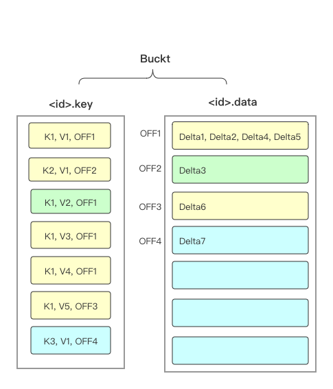

团队成员：刘超，陈林江，周瑜

#### 1. 赛题分析

本次比赛需实现一个多版本的KV数据库引擎，写入为随机写，查询功能为`MinV～NV` Delta的累加结果，同时需支持进程奔溃级的故障恢复。

本赛题的读写比例为7:1，需寻找合适的数据组织方式来最小化写入和查询IO的总耗时。

#### 2. 程序结构及存储结构设计

##### 2.1 分区策略

评测程序是30/15个线程并发的发送数据，读写同时在进行。由于key可能在多个线程中出现，为了减少一次查询的IO次数，我们在写入时让相同的key放入一个文件。但是如果全局单文件的话同步消耗不可忽视。因此我们决定基于key进行分区。最多30个线程写，理想情况下，同一时间每个线程写不同的文件，因此将分区定为30。文件Id为hash(key)%30。

由于索引结构中包含了key/version，因此查询时不需要文件中的key/version，所以在一个分区下我们将key/version存入一个文件，delta存一个文件，查询时只需读取delta文件。

##### 2.2 存储结构&索引结构

为了让读取尽量能够在一次IO中完成，我们采用了随机写delta数据的方式，尽量将相同的key紧凑的存储，将文件分为多个page，page的大小固定，如果一个key的delta超过了page的阈值，则顺序开辟一个page存放此key的delta，一个page中只会存放一个key的delta。

key和version采用顺序追加写，同时每个key/version后面追加一个delta的偏移坐标。一个分区Bucket的结构如下图所示：



Key/ Version文件有两个作用

1. 故障恢复时构建内存索引。
2. 当数据总量大至索引无法在内存中存放，可以将key/version文件排序，在内存中构建稀疏索引，采用二分查找来查询所需的key和 version。

由于索引数据可以全放入内存，相比于B+树，Hash索引更具有查询优势。因此采用基本LongObjectHashMap充当索引，即Key -> Versions的映射，Versions保存了key所有的v，以及该key所拥有的pages。

#### 3. 读写实现

通过hash(key)取得key的分区Id，根据当前分区的索引判断key是否需要开辟一个page，如果不需要就将delta追加至已存在的page中。否则就开辟新page，并且将新的page位置添加至索引中。key/version/off追加至id.key文件。

```java
public void write(long v, DeltaPacket.DeltaItem item, byte[] exceed) throws IOException {
  long key = item.getKey();
  ByteBuffer writeBuf = LOCAL_WRITE_BUF.get();
  int pos;
  Versions versions;
  synchronized (lock) {
    versions = index.get(key);
    if (versions == null) {
      versions = new Versions(DEFAULT_SIZE);
      index.put(key, versions);
    }
    // 计算这个version写盘的位置
    if (versions.needAlloc()) {
      pos = dataPosition;
      dataPosition += page_size;
    } else {
      int base = versions.off[versions.size / page_field_num];
      pos = base + (versions.size % page_field_num) * item_size;
    }
    writeData(writeBuf, item.getDelta(), exceed, pos);
    versions.add((int) v, pos);
    writeKey(writeBuf, key, v, pos, id);
  }
}
```


key只会在一个文件中，只需找到相应的bucket中的Map索引，遍历Versions中的version即可，因为delta是聚集存储，基本上一次IO即可完成查询。

#### 4. 优化点
 - 压缩

   Package中可能有多个相同的key，由于Package内共享一个version，因此可以认为相同的key的delta可以累加为1个。n个key的field占用空间`M = (32 + log2n)*64 /8`

 - 缓存

   由于写入和读取在引擎侧基本都是内存复用，评测结束还有3.5G左右的内存空闲，但是由于评测程序占用内存的峰值在2G左右，我们采用了通用的2G固定大小的缓存。

   - 还有些没有采用的定向优化方案，比如二阶段写入时缓存替换、绕过峰值追加缓存等等

 - JVM gc参数调优

   1. 调大年轻代老年代的比例，减少full GC次数，线上full gc由于之前1:1 的至少三次降至最多一次
   2. `使用-XX:+UseAdaptiveSizePolicy`自适应调节STW和吞吐
   
   最终gc的耗时在4秒左右

#### 5. 总结

从第一个版本的900秒至最后的85秒，当然85远不是Java实现的极限，完全利用内存应该是50~55秒之间。这是一个非常有趣的过程，同时也收获满满。

#### 致谢


